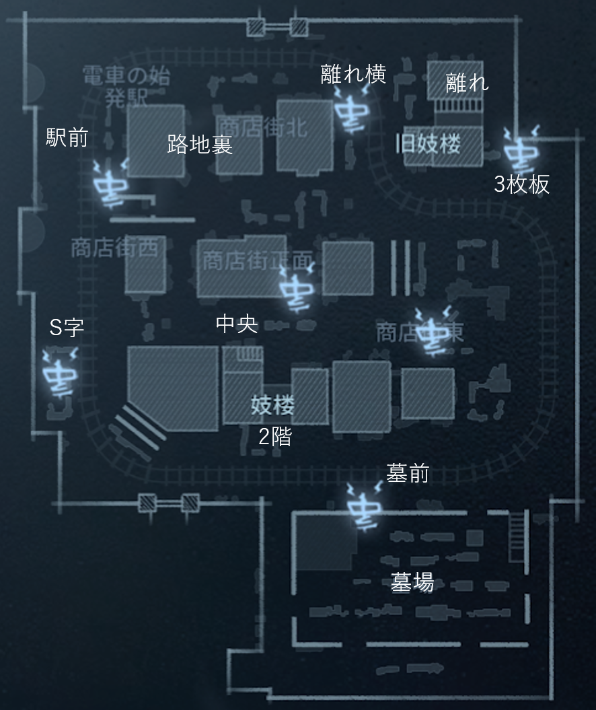
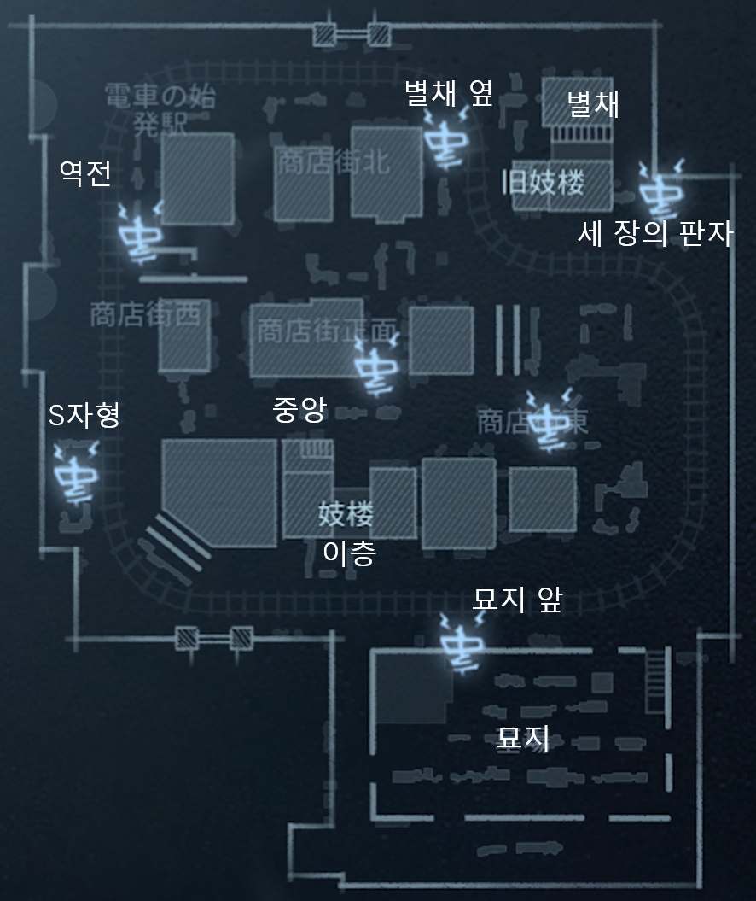

# Ever sleeping town／永眠町／에버 슬리핑 타운

## Position name

|日本語|発音|한국어|발음|
|:-:|:-:|:-:|:-:|
|駅前|えきまえ|역전|yokjjon|
|路地裏|ろじうら|||
|離れ横|はなれよこ|별채 옆|byolchae yop|
|３枚板|さんまいいた|세 장의 판자|se jange panja|
|中央|ちゅうおう|중앙|jungang|
|離れ|はなれ|별채|byolchae|
|美智子前|みちこまえ|||
|墓前|はかまえ|묘지 앞|myoji ap|
|墓場|はかば|묘지|myoji|
|２階|にかい|이층|icheung|
|S字|えすじ|S자형|esseujahyong|

## Map

マップ修正中・・・

<!-- 

 -->
