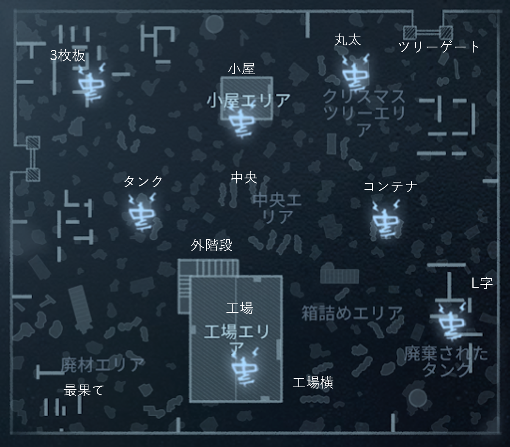
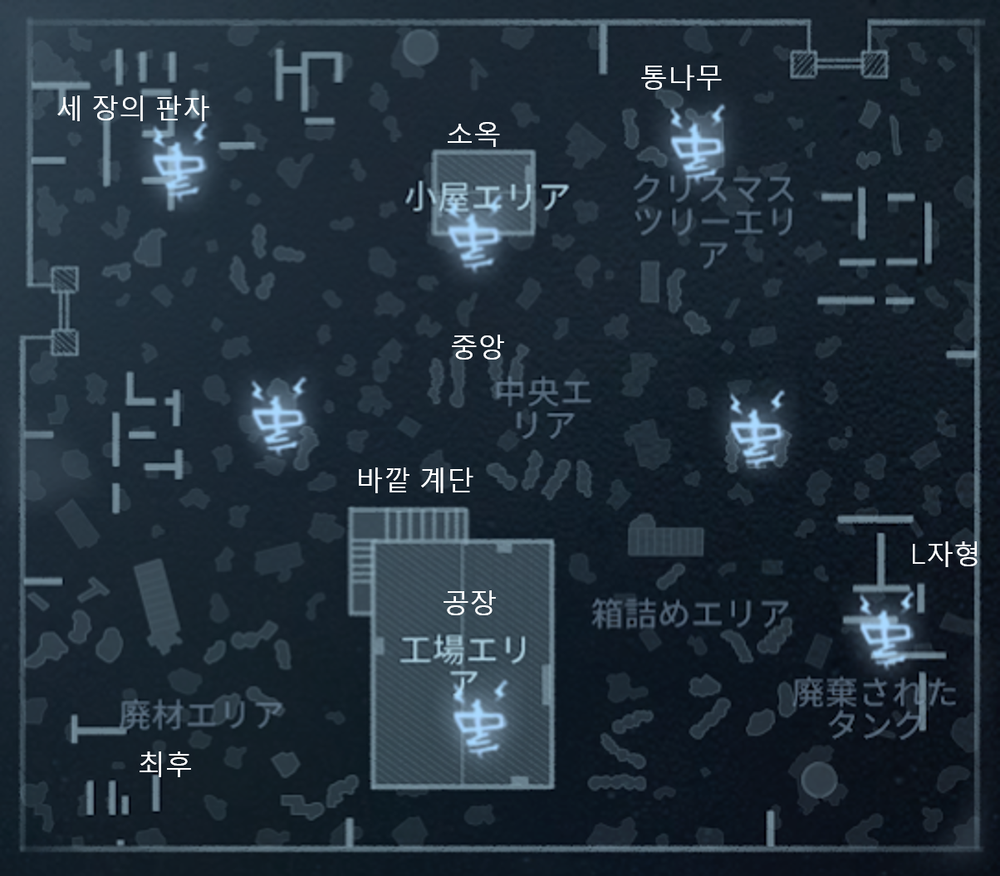

# Leo's memory／レオの思い出／레오의 기억

## Position name

|日本語|発音|한국어|발음|
|:-:|:-:|:-:|:-:|
|３枚板|さんまいいた|세 장의 판자|se jange panja|
|小屋|こや|소옥|sook|
|丸太|まるた|통나무|tongnamu|
|ツリーゲート|つりーげーと|||
|コンテナ|こんてな|||
|L字|えるじ|L자형|eljahyong|
|中央|ちゅうおう|중앙|jungang|
|工場|こうじょう|공장|gongjang|
|工場横|こうじょうよこ|공장 옆|gongjang yop|
|外階段|そとかいだん|바깥 계단|bakkat gyedan|
|最果て|さいはて|최후|chwehu|
|タンク|たんく|||

## Map

