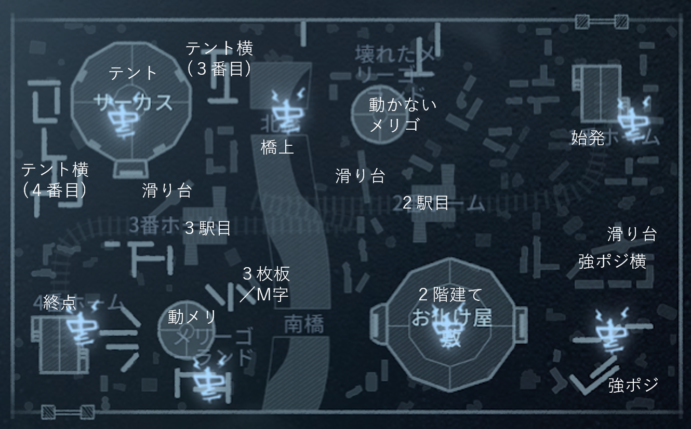
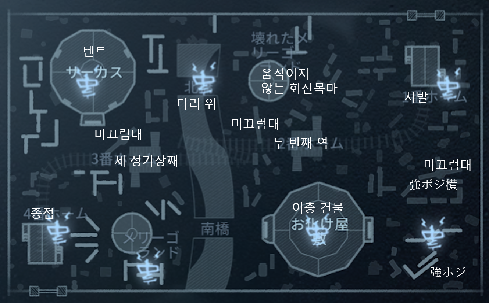

# Ever sleeping town／永眠町／韓国語

|日本語|発音|한국어|발음|
|:-:|:-:|:-:|:-:|
|始発|しはつ|시발|sibal|
|強ポジ横|きょうぽじよこ|||
|強ポジ|きょうぽじ|||
|２駅目|にえきめ|두 번째 역|du bonjjae yok|
|２階建て|にかいだて|이층 건물|icheung gonmul|
|滑り台|すべりだい|미끄럼대|mikkeuromttae|
|動かないメリゴ|うごかないめりご|움직이지 않는 회전목마|umjigiji anneun hwejonmongma|
|橋上|はしうえ|다리 위|dari wi|
|３駅目|さんえきめ|세 정거장째|se jonggojangjjae|
|３枚板／M字|さんまいいた／えむじ|세 장의 판자|se jange panja|
|動メリ|うごめり|||
|テント|てんと|텐트|tenteu|
|テント横|てんとよこ|텐트 옆|tenteu yop|
|終点|しゅうてん|종점|jongjjom|

