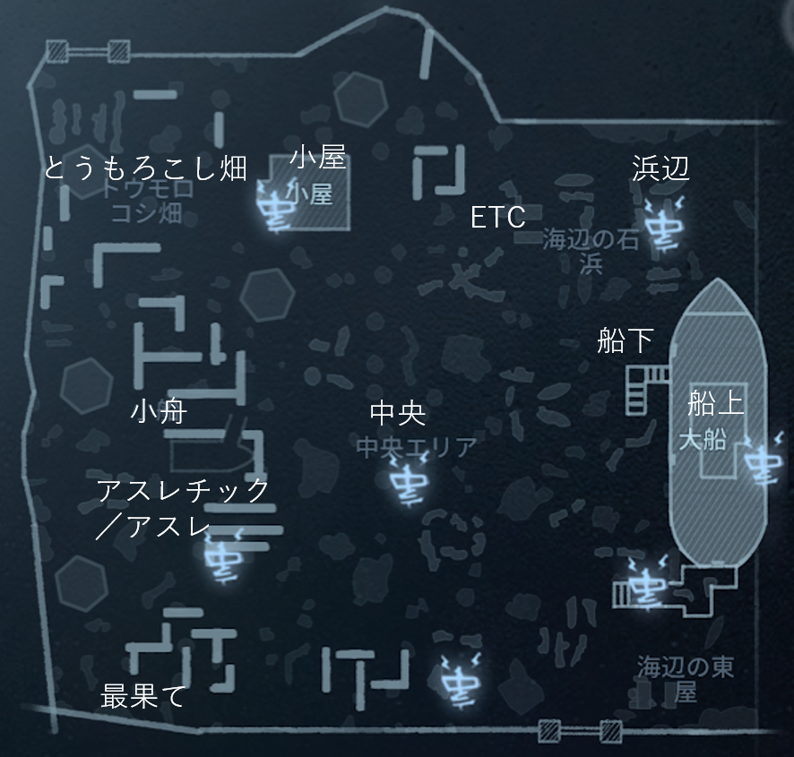
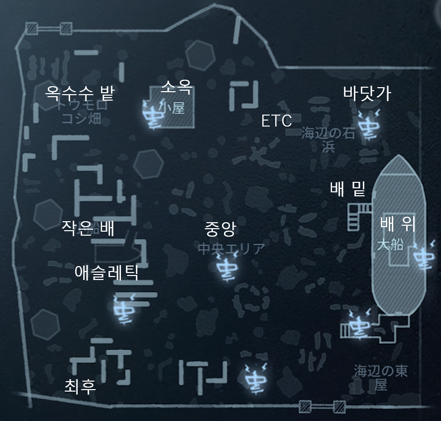

# 湖景村

|日本語|発音|한국어|발음|
|:-:|:-:|:-:|:-:|
|小屋|こや|소옥||
|とうもろこし畑|とうもろこしばたけ|옥수수 밭||
|ETC||||
|浜辺|はまべ|바닷가||
|船上|ふねうえ|배 위||
|船下|ふねした|배 밑||
|中央|ちゅうおう|중앙||
|小舟|こぶね|작은 배||
|アスレチック／アスレ|あすれちっく／あすれ|애슬레틱||
|最果て|さいはて|최후||

