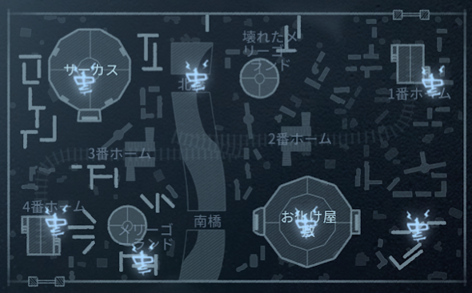

# 月の河公園

|日本語|発音|한국어|발음|
|:-:|:-:|:-:|:-:|
|始発|しはつ|시발||
|強ポジ横|きょうぽじよこ|||
|強ポジ|きょうぽじ|||
|２駅目|にえきめ|두 번째 역||
|２階建て|にかいだて|이층 건물||
|滑り台|すべりだい|미끄럼대||
|動かないメリゴ|うごかないめりご|움직이지 않는 회전목마||
|橋上|はしうえ|다리 위||
|３駅目|さんえきめ|세 정거장째||
|３枚板／M字|さんまいいた／えむじ|세 장의 판자||
|動メリ|うごめり|||
|テント|てんと|텐트||
|テント横|てんとよこ|텐트 옆||

